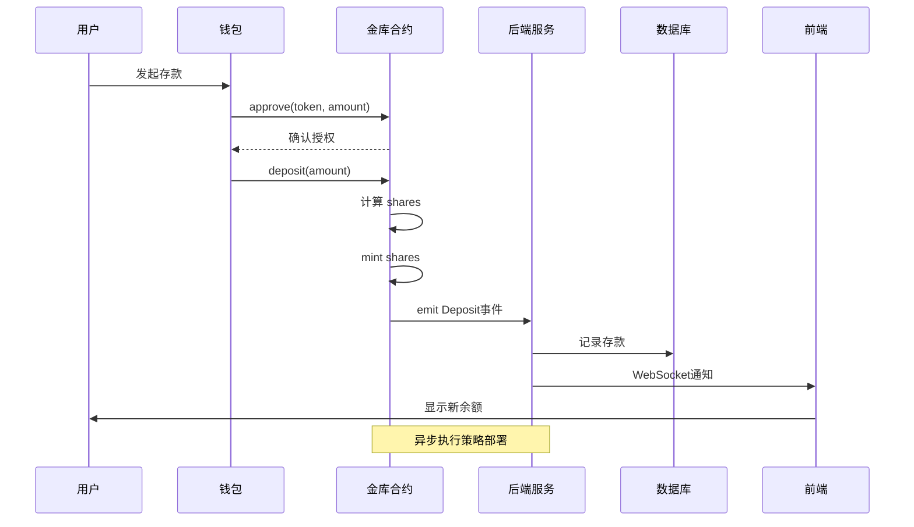

# 阶段1：项目概览与架构（3个任务）

**目标**：建立对 Yieldera 的整体认知，明确金库模块在系统中的位置

**预计时间**：2天（6-8小时）

---

## 任务 1.1 - 架构鸟瞰图

### 📚 晨读内容（30分钟）

#### 需要阅读的文件：
1. `README.md` - 项目整体介绍
2. `YIELDERA_BRAND_GUIDE.md` - 品牌和技术定位
3. `contracts/core/` - 核心合约目录结构
4. `internal/blockchain/` - Go 后端区块链交互层

#### 关键理解点：
- **Yieldera 的定位**：积分聚合 + DeFi 收益优化平台
- **金库的角色**：资产托管 + 收益策略执行
- **技术栈**：Solidity + Go + React + PostgreSQL
- **外部依赖**：Aave、Uniswap、Chainlink

### 💻 晚练任务（60分钟）

#### 1. 绘制 4 层架构图

```
┌─────────────────────────────────────────────────────────────┐
│                        用户层                                 │
│  Web3 Wallet + 前端界面 (React)                              │
└─────────────────────────────────────────────────────────────┘
                            ↕
┌─────────────────────────────────────────────────────────────┐
│                      智能合约层                               │
│ ┌──────────────┐  ┌──────────────┐  ┌──────────────┐       │
│ │CollateralVault│  │ LoyaltyUSD  │  │DeFi Adapters│        │
│ └──────────────┘  └──────────────┘  └──────────────┘       │
└─────────────────────────────────────────────────────────────┘
                            ↕
┌─────────────────────────────────────────────────────────────┐
│                      后端服务层 (Go)                          │
│ ┌──────────────┐  ┌──────────────┐  ┌──────────────┐       │
│ │  区块链监听  │  │  API服务     │  │  数据处理    │        │
│ └──────────────┘  └──────────────┘  └──────────────┘       │
└─────────────────────────────────────────────────────────────┘
                            ↕
┌─────────────────────────────────────────────────────────────┐
│                      外部协议层                               │
│  Aave  │  Uniswap V3  │  Chainlink  │  跨链桥               │
└─────────────────────────────────────────────────────────────┘
```

#### 2. 标注关键组件

创建组件清单表：

| 层级 | 组件名称 | 主要职责 | 输入 | 输出 |
|------|---------|---------|------|------|
| 合约层 | CollateralVault | 资金托管、份额管理 | ETH/Token | Shares |
| 合约层 | LoyaltyUSD | 稳定币铸造 | 抵押品 | LUSD |
| 合约层 | PriceOracle | 价格反馈 | Token地址 | USD价格 |
| 后端层 | VaultService | 事件监听、状态同步 | 链上事件 | DB记录 |
| 后端层 | MetricsService | 指标计算 | 原始数据 | APY/TVL |
| 前端层 | VaultView | 用户交互 | 用户操作 | 交易签名 |

#### 3. 撰写架构文档

创建 `01_arch_overview.md`，包含：

```markdown
# Yieldera 架构概览

## 系统定位
[1-2段描述项目愿景和技术特点]

## 四层架构

### 1. 用户层
- 功能：...
- 技术栈：...
- 关键交互：...

### 2. 智能合约层
[详细描述每个合约的职责]

### 3. 后端服务层
[描述 Go 服务的架构]

### 4. 外部协议层
[列出依赖的 DeFi 协议]

## 金库模块位置
[专门说明金库在整个系统中的位置和作用]

## 关键设计决策
1. 为什么选择 EIP-4626 标准？
2. 为什么需要 Go 后端？
3. 如何处理跨链？

## 架构图
[粘贴或链接图片]
```

### ✅ 通过标准

**自我测试**：闭上眼睛，2-3分钟内口述：
1. 用户存款的完整路径（从钱包到策略）
2. 金库如何与 DeFi 协议交互
3. 后端的 3 个主要职责
4. 哪些数据在链上，哪些在链下

**检查清单**：
- [ ] 架构图清晰标注了 4 层
- [ ] 每层至少 3 个组件
- [ ] 数据流向标注清楚
- [ ] 文档不少于 500 字
- [ ] 包含至少 1 个设计权衡说明

---

## 任务 1.2 - 关键边界与数据流

### 📚 晨读内容（45分钟）

#### 核心问题：
1. 用户如何存入资金？
2. 金库如何知道收益？
3. 用户如何赎回？
4. 风险事件如何处理？
5. 跨链消息如何传递？
6. 前后端如何同步状态？

#### 需要梳理的交互：
```
交互1: 用户存款
用户 → 钱包授权 → 合约存款 → 事件发出 → 后端捕获 → DB记录 → 前端刷新

交互2: 策略收益
定时器 → 调用harvest → 收益换回 → PPS上涨 → 事件通知 → 指标更新

交互3: 用户赎回
用户请求 → 合约计算 → 资金转出 → 事件记录 → 后端更新 → 余额刷新

交互4: 价格更新
预言机 → 链上喂价 → 合约读取 → 健康度检查 → 风控决策

交互5: 清算流程
监控检测 → 清算触发 → 抵押品拍卖 → 债务清偿 → 状态同步

交互6: 跨链桥接
源链事件 → 中继捕获 → 目标链验证 → 状态同步 → 确认回执
```

### 💻 晚练任务（75分钟）

#### 1. 绘制时序图

为每个关键流程画时序图，使用 Mermaid 语法：



#### 2. 创建故障场景表

| 场景 | 触发条件 | 检测方式 | 回滚机制 | 用户提示 |
|------|---------|---------|---------|---------|
| Gas不足 | 交易发送失败 | 前端预估 | 不发送交易 | "请增加Gas限额" |
| 流动性不足 | 赎回金额过大 | 合约检查 | revert | "超过可用流动性" |
| 预言机失效 | 价格陈旧 | 时间戳检查 | 暂停操作 | "系统维护中" |
| 后端宕机 | 事件未捕获 | 监控告警 | 重放日志 | 正常（链上数据为准）|

#### 3. 撰写数据流文档

创建 `02_dataflows.md`：

```markdown
# Yieldera 关键数据流

## 数据流1: 用户存款
### 参与方
- 用户、钱包、金库合约、后端、数据库、前端

### 输入
- amount: uint256 (存款金额)
- token: address (代币地址)

### 流程
1. [前端] 用户输入金额
2. [钱包] 签名授权交易
3. [合约] 验证余额和授权
4. [合约] 计算并铸造份额
5. [合约] 发出 Deposit 事件
6. [后端] 监听到事件
7. [后端] 解析参数并写入DB
8. [前端] 轮询或订阅更新

### 输出
- shares: uint256 (用户获得的份额)
- 事件: Deposit(user, amount, shares)
- DB记录: deposits 表新增一行

### 失败场景
| 失败点 | 原因 | 回滚 |
|--------|------|------|
| Step2 | 用户取消 | 无状态变化 |
| Step3 | 余额不足 | revert |
| Step4 | 计算溢出 | revert |
| Step6 | 网络延迟 | 后续补偿 |

### 关键不变量
- totalAssets = sum(userBalances)
- totalShares = sum(userShares)
- PPS = totalAssets / totalShares

---

[继续描述其他 5 个数据流...]
```

### ✅ 通过标准

**验收要点**：
- [ ] 至少 6 条数据流
- [ ] 每条包含：触发方、输入、输出、失败场景
- [ ] 至少 3 个时序图
- [ ] 标注了关键不变量
- [ ] 说明了回滚机制

**自测问题**：
1. 如果后端宕机，用户资金安全吗？
2. 事件重放如何避免双花？
3. PPS 更新的触发时机？

---

## 任务 1.3 - 术语表

### 📚 晨读内容（30分钟）

#### 需要掌握的术语分类：

**金库相关**
- PPS (Price Per Share)
- TVL (Total Value Locked)
- Share (份额)
- Harvest (收获)
- Rebalance (再平衡)
- Strategy (策略)
- Buffer (缓冲池)

**DeFi 通用**
- APY/APR
- Slippage (滑点)
- Liquidity (流动性)
- LP Token
- Yield Farming
- Impermanent Loss

**借贷相关**
- LTV (Loan-to-Value)
- HF (Health Factor)
- Collateral Ratio
- Liquidation
- Interest Rate

**技术相关**
- TWAB (Time-Weighted Average Balance)
- Oracle (预言机)
- Keeper/Bot
- Gas Optimization
- Reentrancy

### 💻 晚练任务（45分钟）

创建 `03_glossary.md`：

```markdown
# Yieldera 术语表

## 金库核心概念

### PPS (Price Per Share) - 每份额价格
**定义**：1 个金库份额对应的基础资产价值

**公式**：
```
PPS = totalAssets / totalShares
```

**示例**：
- 初始：存入 1000 USDC，铸造 1000 份额，PPS = 1.0
- 收益后：资产变为 1100 USDC，份额不变，PPS = 1.1
- 用户赎回：持有 100 份额，可赎回 100 × 1.1 = 110 USDC

**关键特性**：
- 只增不减（除非亏损）
- 复利效应体现在 PPS 增长
- 不同用户共享同一 PPS

**代码位置**：
```solidity
// CollateralVault.sol
function pricePerShare() public view returns (uint256) {
    if (totalShares == 0) return 1e18;
    return (totalAssets * 1e18) / totalShares;
}
```

---

### TVL (Total Value Locked) - 锁定总价值
**定义**：协议中锁定的所有资产的美元价值总和

**计算**：
```
TVL = Σ(tokenBalance_i × tokenPrice_i)
```

**示例**：
- 金库A：1000 ETH × $2000 = $2,000,000
- 金库B：500,000 USDC × $1 = $500,000
- 总TVL = $2,500,000

**意义**：
- 衡量协议规模
- 影响收益分配效率
- 风险承受能力指标

---

### Share - 金库份额
**定义**：用户在金库中所有权的证明，类似股票

**工作机制**：
```
存款时：shares = amount / PPS
赎回时：amount = shares × PPS
```

**示例**：
- Alice 存入 100 USDC（PPS=1.0）→ 获得 100 份额
- Bob 存入 100 USDC（PPS=1.1）→ 获得 90.9 份额
- 两人持有不同份额，但享受相同的收益率

---

### Harvest - 收获收益
**定义**：将策略中赚取的奖励代币换回基础资产，提高 PPS

**流程**：
1. 从 Aave/Uni 等协议领取奖励代币
2. 通过 DEX 换回 USDC
3. 扣除管理费
4. 重新投入策略
5. PPS 上涨

**触发条件**：
- 收益 > Gas 成本 + 滑点
- 距上次 harvest 超过 X 小时
- 手动触发（管理员）

**代码示例**：
```solidity
function harvest() external onlyKeeper {
    uint256 rewards = strategy.claimRewards();
    uint256 assets = swap(rewards, baseToken);
    totalAssets += assets;
    emit Harvested(assets);
}
```

---

## DeFi 通用术语

### APY (Annual Percentage Yield) - 年化收益率
**定义**：考虑复利的年化收益百分比

**公式**：
```
APY = (1 + r/n)^n - 1
r = 期间收益率
n = 复利次数
```

**示例**：
- 日收益 0.1%，年化 APY = (1.001)^365 - 1 = 44.02%
- 月收益 2%，年化 APY = (1.02)^12 - 1 = 26.82%

**vs APR**：APR 不考虑复利，APY > APR

---

### Slippage - 滑点
**定义**：交易执行价格与预期价格的偏差

**公式**：
```
Slippage = (执行价格 - 预期价格) / 预期价格 × 100%
```

**示例**：
- 预期：1 ETH = 2000 USDC
- 实际：1 ETH = 1980 USDC
- 滑点 = -1%

**风险**：
- 大额交易滑点更大
- 低流动性池滑点高
- 可能被 MEV 攻击

---

## 借贷术语

### LTV (Loan-to-Value) - 贷款价值比
**定义**：贷款金额占抵押品价值的百分比

**公式**：
```
LTV = Debt / CollateralValue × 100%
```

**示例**：
- 抵押 1 ETH ($2000)
- 借出 1000 USDC
- LTV = 50%

**限制**：
- Max LTV = 75%（超过则无法借款）
- Liquidation LTV = 80%（超过则被清算）

---

### Health Factor (HF) - 健康因子
**定义**：衡量借贷仓位安全性的指标

**公式**：
```
HF = (Collateral × LiquidationThreshold) / Debt
```

**阈值**：
- HF > 1.0：安全
- HF = 1.0：临界点
- HF < 1.0：可被清算

**示例**：
- 抵押品：$2000
- 清算阈值：80%
- 债务：$1200
- HF = (2000 × 0.8) / 1200 = 1.33（安全）

---

## 技术术语

### Oracle - 预言机
**定义**：为智能合约提供链下数据的服务

**类型**：
1. **Chainlink**：去中心化预言机网络
2. **TWAP**：基于 DEX 的时间加权平均价格
3. **手动喂价**：管理员更新

**防操纵**：
- 多源聚合
- 时间延迟
- 异常检测

---

### Reentrancy - 重入攻击
**定义**：利用外部调用时状态未更新的漏洞

**示例**：
```solidity
// 错误示例
function withdraw() external {
    uint amount = balances[msg.sender];
    msg.sender.call{value: amount}(""); // 外部调用
    balances[msg.sender] = 0; // 晚于外部调用
}

// 正确示例
function withdraw() external {
    uint amount = balances[msg.sender];
    balances[msg.sender] = 0; // 先更新状态
    msg.sender.call{value: amount}("");
}
```

**防护**：
- 使用 ReentrancyGuard
- 遵循 Checks-Effects-Interactions 模式

---

## 快速参考表

| 术语 | 中文 | 典型值/范围 | 单位 |
|------|------|------------|------|
| PPS | 每份额价格 | 1.0 → ∞ | 资产/份额 |
| TVL | 锁定总价值 | $1M - $1B | USD |
| APY | 年化收益 | 5% - 50% | % |
| LTV | 贷款价值比 | 0% - 75% | % |
| HF | 健康因子 | 1.0 - 10.0 | 倍数 |
| Slippage | 滑点 | 0.1% - 5% | % |

---

## 延伸阅读

- [EIP-4626](https://eips.ethereum.org/EIPS/eip-4626) - 金库标准
- [Yearn Finance Docs](https://docs.yearn.finance/) - 金库实践
- [Aave Documentation](https://docs.aave.com/) - 借贷协议
- [Uniswap V3 Book](https://uniswapv3book.com/) - AMM 原理
```

### ✅ 通过标准

**验收清单**：
- [ ] 至少 20 个术语
- [ ] 每个术语包含：定义、公式、示例
- [ ] 分类清晰（金库/DeFi/借贷/技术）
- [ ] 提供代码位置或示例
- [ ] 有快速参考表

**自测**：任选 5 个术语，1 分钟内解释清楚并举例

---

## 阶段1总结

完成上述 3 个任务后，你应该能够：

✅ **理解能力**
- 用 5 分钟讲清楚 Yieldera 是什么
- 画出系统架构并解释每层作用
- 说明金库在整个生态中的位置

✅ **技术能力**
- 识别 6 条关键数据流
- 理解份额制会计的原理
- 掌握 20+ 核心术语

✅ **产出物**
- `01_arch_overview.md` - 架构文档
- `02_dataflows.md` - 数据流文档
- `03_glossary.md` - 术语表

---

## 下一步

进入 [阶段2: 智能合约层](./STAGE2_CONTRACTS.md)，深入学习金库合约的实现细节。
